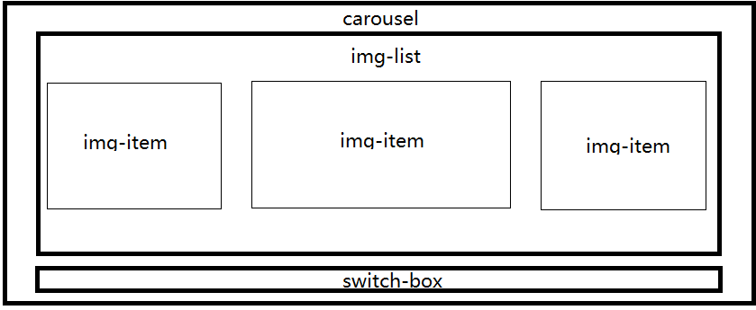

# 1：最终要实现的效果
Github地址：[github.com/ovenzeze/AccordionCarousel](https://github.com/ovenzeze/AccordionCarousel)
Demo地址：[http://urlc.cn/RCa7B2](http://123.206.204.163/AccordionCarousel/index.html)
<!--more-->
# 2：使用方法
```
var carousel1 = new AccordionCarousel({
    wrap:$('#carousel1'),
    data:[{
    url:'http://p3.music.126.net/rqWhUkC33KinmtGFrU-dWw==/3265549618510021.jpg',
    img:'http://p3.music.126.net/rqWhUkC33KinmtGFrU-dWw==/3265549618510021.jpg'
    },{
    url:'http://p3.music.126.net/rqWhUkC33KinmtGFrU-dWw==/3265549618510021.jpg',
    img:'http://p3.music.126.net/rqWhUkC33KinmtGFrU-dWw==/3265549618510021.jpg'
    },{
    url:'http://p4.music.126.net/eGJ1GvzSG5vJS2cosbOaNA==/18745573743306085.jpg',
    img:'http://p4.music.126.net/eGJ1GvzSG5vJS2cosbOaNA==/18745573743306085.jpg'
    },{
    url:'http://p3.music.126.net/WYEfOTNQLhiGTnuk4hCsTw==/18712588394461003.jpg',
    img:'http://p3.music.126.net/WYEfOTNQLhiGTnuk4hCsTw==/18712588394461003.jpg'
    },{
    url:'http://p4.music.126.net/eGJ1GvzSG5vJS2cosbOaNA==/18745573743306085.jpg',
    img:'http://p4.music.126.net/eGJ1GvzSG5vJS2cosbOaNA==/18745573743306085.jpg'
    },{
    url:'http://p3.music.126.net/UIDhV5lTWBhWgzal9i-Igg==/2946691247468785.jpg',
    img:'http://p3.music.126.net/UIDhV5lTWBhWgzal9i-Igg==/2946691247468785.jpg'
    },{
    url:'http://p4.music.126.net/ACnbpSMrbJSNc6pByzPBEw==/18796151278061249.jpg',
    img:'http://p4.music.126.net/ACnbpSMrbJSNc6pByzPBEw==/18796151278061249.jpg'
    }]
    });
```
`new`一个`AccordionCarousel`实例，传入包裹轮播的`DIV`和每一张图片的链接和地址，会自动根据图片的数量来生成轮播图和指示器。由于用到了`Jquery`，所以要用`Jquery`的方式来传递参数。
# 3：实现方案
## 3.1：整体布局

 最外层是包裹整个轮播和指示器的`div`，所有的图片放在`class`为`img-list`的这个`div`内，与`img-list`同级的还有一个`class`为`switchbox`指示器的`div`.
## 3.2：CSS结构
因为这种方式的轮播图每张图片的位置都不一样，所以无法使用将所有图片拼接为一张再通过控制left值的方式来达到轮播的效果。所以在这里我为每个图片的位置设置了定位，一共五个位置，每个位置根据不同的`class`类名来区分，通过动态的切换类名来达到轮播的效果。
具体类名和位置如下：

 
在这里，为了达到有切换时图片从一个位置到另一个位置的切换效果，我一共使用了五个位置，在`img-list`的区域内有前一张图片（对应类名为`img-prev`），当前图片（对应类名为`img-current`），下一张图片（对应类名为`img-next`），而就绪状态的前一张图片（对应类名为`img-prev-ready`）和就绪状态的下一张图片（`img-next-ready`）。左右两侧的四张图片使用了`CSS3`中的`transform`属性，主要用到的是`perspective` `rotateY` `translateZ`三个属性，具体的使用大家可以参考MDN。
参考资料：
[MDN-transform属性](https://developer.mozilla.org/zh-CN/docs/Web/CSS/transform)
[MDN-使用CSS3transform属性](https://developer.mozilla.org/zh-CN/docs/Web/CSS/CSS_Transforms/Using_CSS_transforms)
## 3.3：JS控制
库文件的基本结构如下：
```
function AccordionCarousel(event) {
    imgNumber = event.data.length;
    indexNext = 4;
    indexPrev = 0;
    indexCurrent = 2;
    this.wrap = event.wrap || $('body');
    this.init(event.data);
}
AccordionCarousel.prototype = {
    constructor: AccordionCarousel,
    //将constructor重新指向构造函数
    init: function(data) {
    //初始化数据，插入DOM结构
}
    bindEvent:function(data){
    //为图片绑定点击事件
}
    switchPic:function(data){
    //切换图片的逻辑处理
}
    switchItem:function(){
    //指示器的显示和切换
}
```
# 4：此方案中的一些坑
## 4.1：事件绑定的更新
在之前的方案中，我直接将点击之后的处理逻辑绑定到单独的`class`上，代码如下：
```
            $('.next-img').on('click', data, this.nextPic);
nextPic:function(){
            $('.prev-img-ready').removeClass('prev-img-ready').addClass('other-img');
            $('.prev-img').removeClass('prev-img').addClass('prev-img-ready');
            $('.current-img').removeClass('current-img').addClass('prev-img');
            $(this).removeClass('next-img').addClass('current-img');
            $('.next-img-ready').removeClass('next-img-ready').addClass('next-img');
            indexNext = indexNext < imgNumber - 1 ? ++indexNext : 0;
            $('.img-list .img-item:eq(' + indexNext + ')').removeClass('other-img').addClass('next-img-ready');
            indexCurrent = indexCurrent >= imgNumber - 1 ? 0 : ++indexCurrent;
            indexPrev = indexPrev > imgNumber - 1 ? 0 : ++indexPrev;
}
```
这里的问题就是，我根据`class`值为`DOM`元素绑定点击事件，在事件触发后，即使这个`DOM`元素不在具有绑定的`class`值了，事件仍然绑定在此元素上，所以新的具有此`class`值的元素当然也就无法绑定到对应的事件上。
所以我现在的解决方案就是，不再根据图片的位置绑定不同的处理函数，直接为所有的图片点击事件添加监听，在事件触发后再根据是否具有对应的`class`值来使用不同的处理逻辑。
# 5：思路拓展
## 5.1：布局方案
现在采用的是根据类名来固定图片的位置，但是在操作图片的时候需要遍历所有的图片再找出对应的类名，这个操作是很不经济的。可以选择的一种方式是：使用五个固定的位置，根据对其中的位置绑定点击事件来使用不同的处理逻辑来切换图片，这样就不在需要为所有图片添加点击事件，代码更加简洁，也更加经济。
## 5.2：指示器
现在的指示器只能起到指示图片位置的作用，可以再稍加拓展一下，达到点击或者鼠标悬停时自动切换到对应的图片的功能。但是这种方式用我现在这种处理逻辑会很麻烦。再者，我现在使用的方案中没有通过为图片添加一个自定义的`index`属性来达到索引图片的目的，直接使用了`DOM`结构中的类数组来索引图片。推荐的方式是：使用统一的图片切换函数，为图片添加自定义属性`index`索引图片，只需要传入目标图片的`index`值就可以切换到对应图片。
## 5.3：优化引入方式
现在的方案里，需要引入三个文件，分别是`Jquery`库，我的`AccordionCarousel`库和对应的`CSS`文件，时间充裕的话，可以尝试使用原生`JavaScript`来写这个轮播，还可以把`CSS`的部分也用`JavaScript`代码的方式添加，这样就可以达到引入一个文件就可以使用的效果，这也是目前常规的做法。
# 6：总结
这是我第一次做一个组件库，踩了不少坑，也花了不少时间。总结起来就是`JavaScript`中还有很多高级特性需要细细探究，像我的代码中还用到了三个全局变量，如果我对原型链，`this`用法，闭包等再熟练一些应该完全可以避免。当然这个库还有很多地方需要完善，需要学习很多东西。